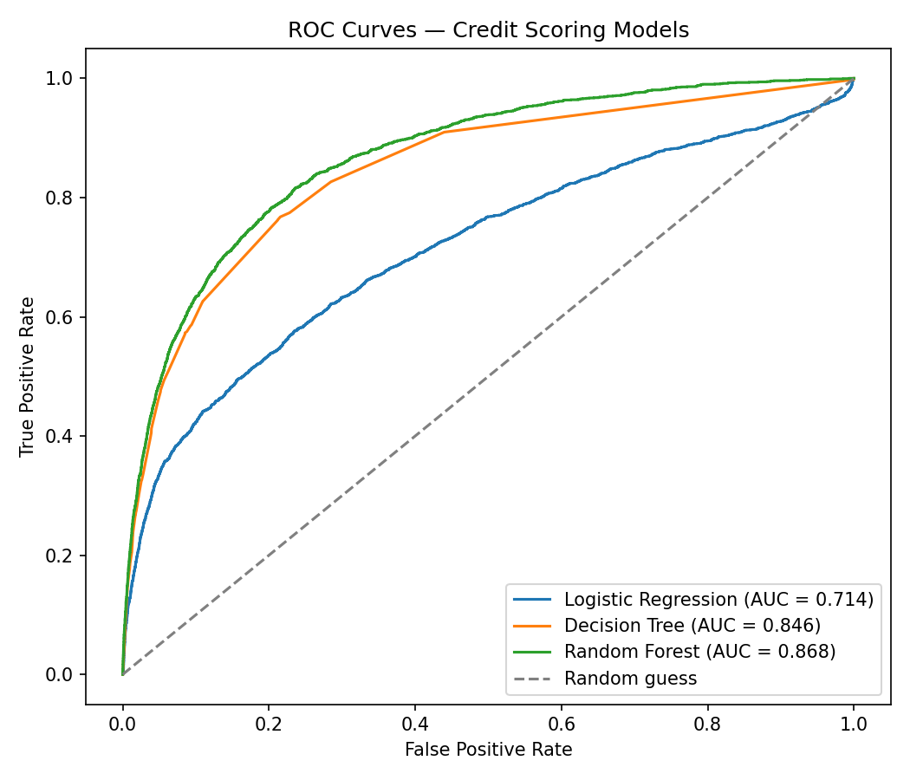
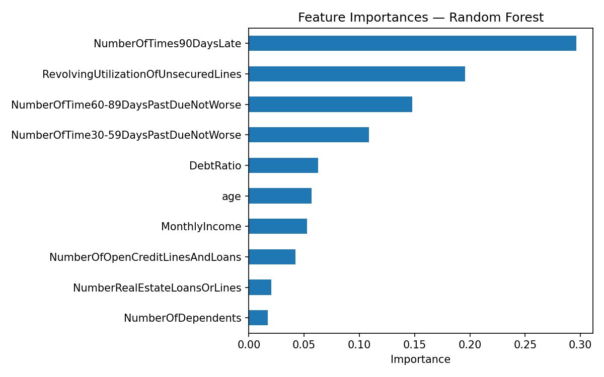

# CodeAlpha_CreditScoringModel

## 📌 Objective
Predict an individual's **creditworthiness** using past financial data, applying classification algorithms and evaluating them with industry-standard metrics.

This project was completed as **Task 1** of the CodeAlpha Machine Learning Internship.

---

## 📊 Dataset
**[Give Me Some Credit](https://www.kaggle.com/c/GiveMeSomeCredit)** (Kaggle)

- 150,000 records, 10 features + 1 target
- Target: `SeriousDlqin2yrs` (1 = person experienced serious delinquency within 2 years, 0 = did not)
- Features include:
  - `RevolvingUtilizationOfUnsecuredLines`
  - `age`
  - `NumberOfTime30-59DaysPastDueNotWorse`
  - `DebtRatio`
  - `MonthlyIncome`
  - `NumberOfOpenCreditLinesAndLoans`
  - `NumberOfTimes90DaysLate`
  - `NumberRealEstateLoansOrLines`
  - `NumberOfTime60-89DaysPastDueNotWorse`
  - `NumberOfDependents`

---

## 🛠️ Approach
1. **Data Cleaning** — filled missing values in `MonthlyIncome` and `NumberOfDependents` with median values.
2. **Feature Scaling** — applied `StandardScaler` (used for Logistic Regression; tree-based models used raw features).
3. **Train/Test Split** — 80/20 split, stratified on the target to preserve class balance.
4. **Models Trained**:
   - Logistic Regression
   - Decision Tree Classifier
   - Random Forest Classifier
5. **Evaluation Metrics** — Accuracy, Precision, Recall, F1-Score, ROC-AUC, Confusion Matrix.

---

## 📈 Results

| Model                | Accuracy | Precision | Recall | F1-Score | ROC-AUC |
|-----------------------|----------|-----------|--------|----------|---------|
| Logistic Regression   | 0.9340   | 0.5806    | 0.0449 | 0.0833   | 0.7143  |
| Decision Tree          | 0.9362   | 0.5701    | 0.1865 | 0.2811   | 0.8456  |
| **Random Forest**      | **0.9375** | **0.6215** | **0.1671** | **0.2634** | **0.8677** |

**Best model: Random Forest**, selected by ROC-AUC — the most reliable metric here given the dataset's class imbalance (only ~6.7% of borrowers are delinquent).

### ROC Curve Comparison


### Feature Importance (Random Forest)


Top predictors of credit risk:
1. `NumberOfTimes90DaysLate`
2. `RevolvingUtilizationOfUnsecuredLines`
3. `NumberOfTime60-89DaysPastDueNotWorse`
4. `NumberOfTime30-59DaysPastDueNotWorse`
5. `DebtRatio`

Past payment delinquency history dominates the model's decisions — unsurprising, since prior late payments are the strongest signal of future default risk.

---

## 📁 Repository Contents
```
CodeAlpha_CreditScoringModel/
├── 1st-task.ipynb                  # Full notebook (data loading → training → evaluation)
├── roc_curves.png                  # ROC curve comparison across all 3 models
├── feature_importance.png          # Random Forest feature importance chart
├── model_comparison_results.csv    # Metrics table for all models
├── best_credit_model.pkl           # Saved best-performing model (Random Forest)
└── README.md
```

---

## ▶️ How to Run
1. Download the [Give Me Some Credit](https://www.kaggle.com/c/GiveMeSomeCredit) dataset (`cs-training.csv`).
2. Open `1st-task.ipynb` in Kaggle Notebooks.
3. Run all cells sequentially — training, evaluation, and plots are generated automatically.

---

## 🧰 Tech Stack
- Python
- Pandas, NumPy
- Scikit-learn
- Matplotlib
- Joblib

---

## 🎓 Internship
This project was completed as part of the **CodeAlpha Machine Learning Internship**.
🔗 [CodeAlpha Website](https://www.codealpha.tech)
